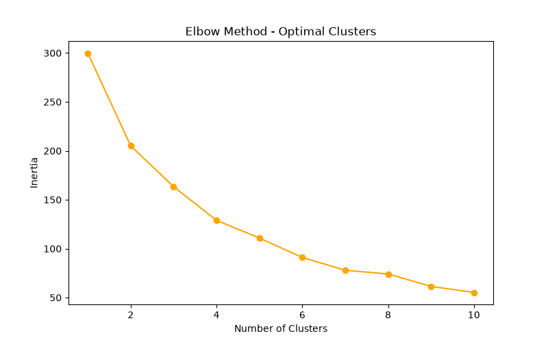
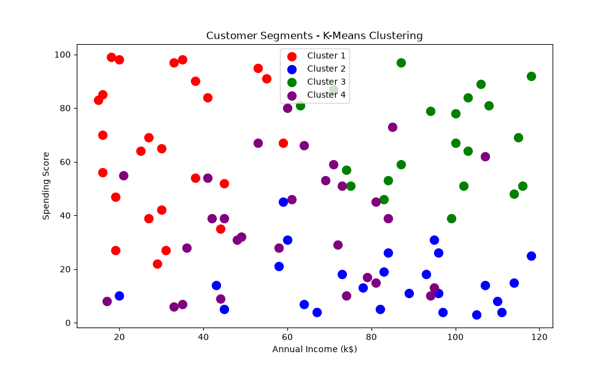

# Customer Segmentation with K-Means

Data Science Internship Project — CodeZoner (June 2026)

## Problem Statement
Businesses struggle to understand different types of customers. 
This project uses K-Means clustering to automatically group customers 
based on their behavior and spending patterns.

## Solution
Used K-Means clustering algorithm to segment customers into distinct 
groups based on age, income, and spending score.

## Tech Stack
- Python 3.x
- Pandas
- Scikit-learn
- Matplotlib
- Seaborn

## Results
- Identified 4 distinct customer segments
- Visualized clusters using scatter plots
- Analyzed spending patterns per segment

## How to Run
pip install pandas scikit-learn matplotlib seaborn

python kmeans_segmentation.py

## Sample Output

## Author
Naveen B — CZ-2026-0168 — CodeZoner June 2026
